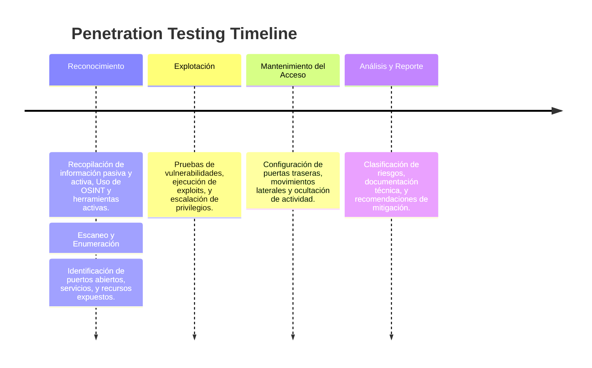

---
Created by: [@raf181_](https://github.com/raf181)  | Date: `19-11-2024`

---

### **Guía Detallada de las Etapas de un Penetration Test**
El **penetration testing** (prueba de penetración) es una metodología estructurada para evaluar la seguridad de sistemas, redes o aplicaciones. Consiste en simular ataques reales en diferentes etapas, buscando identificar, explotar y reportar vulnerabilidades. A continuación, se explican cada una de las etapas en profundidad, incluyendo herramientas recomendadas explicadas en detalle.

---

---
## **1. Reconocimiento**
En esta fase, el objetivo es recopilar toda la información posible sobre el sistema o infraestructura objetivo. Esto se puede realizar de forma **pasiva** (sin interactuar directamente con el objetivo) o **activa** (interactuando con sistemas del objetivo).

### **Subpasos y actividades:**
1. **Investigación OSINT (inteligencia de fuentes abiertas):**  
   Examinar información pública como registros de dominio, redes sociales, correos electrónicos filtrados o datos de infraestructuras visibles en internet.  
2. **Reconocimiento activo:**  
   Realizar consultas específicas para identificar servicios y configuraciones de red.

> [!abstract]- Herramientas de Reconocimiento Pasivo
> - **Shodan:** Un motor de búsqueda para dispositivos y servicios conectados a internet. Permite descubrir servidores, cámaras IP y otros sistemas públicos expuestos.  
> - **OSINT Framework:** Una recopilación de recursos OSINT para buscar información pública sobre dominios, personas o empresas.  
> - **theHarvester:** Recolecta datos de correos electrónicos, nombres de dominio y subdominios a través de motores de búsqueda y plataformas como LinkedIn.

> [!abstract]- Herramientas de Reconocimiento Activo
> - **Nmap:** Realiza escaneos para identificar puertos abiertos, servicios activos y sistemas operativos en la red objetivo.  
> - **WHOIS:** Permite obtener información del registro de dominio, como el propietario y los servidores DNS.  
> - **Nslookup/Dig:** Útiles para obtener registros DNS específicos (A, MX, TXT, etc.).

---

## **2. Escaneo y Enumeración**
En esta etapa se profundiza en los datos técnicos recolectados, identificando servicios, sistemas y configuraciones expuestos. Además, se enumeran recursos como usuarios, directorios o servicios mal configurados.

### **Subpasos y actividades:**
1. **Escaneo de puertos y servicios:** Identificar puertos abiertos y determinar qué servicios están corriendo y sus versiones.  
2. **Enumeración de recursos:** Buscar directorios, usuarios compartidos o configuraciones específicas de sistemas.

> [!abstract]- Herramientas para el Escaneo
> - **Nmap:** Más allá del descubrimiento inicial, puede detectar versiones de software, sistemas operativos y posibles vulnerabilidades.  
> - **Nikto:** Un escáner de vulnerabilidades web que revisa configuraciones inseguras y software obsoleto en servidores web.  
> - **OpenVAS:** Escáner de vulnerabilidades completo para analizar redes y sistemas.  

> [!abstract]- Herramientas para Enumeración
> - **Enum4Linux:** Diseñado para enumerar recursos SMB en sistemas Windows, como usuarios o recursos compartidos.  
> - **Gobuster:** Herramienta rápida para enumerar directorios y subdominios mediante fuerza bruta.  
> - **Hydra:** Para pruebas de fuerza bruta en servicios como SSH, FTP o RDP.

---

## **3. Explotación**
En esta fase se busca explotar las vulnerabilidades identificadas para acceder a sistemas, aplicaciones o redes. Es la etapa más intrusiva y requiere planificación cuidadosa para evitar daños.

### **Subpasos y actividades:**
1. **Pruebas de vulnerabilidades:** Verificar si los servicios detectados son vulnerables a exploits conocidos.  
2. **Ejecución de código o acceso no autorizado:** Realizar ataques dirigidos para obtener acceso inicial.  
3. **Escalación de privilegios:** Elevar el nivel de permisos para obtener control total del sistema.

> [!abstract]- Herramientas de Explotación
> - **Metasploit Framework:** Plataforma robusta para desarrollar y ejecutar exploits, con módulos para escaneo, explotación y post-explotación.  
> - **SQLmap:** Automatiza la explotación de vulnerabilidades de inyección SQL, permitiendo extraer datos de bases de datos vulnerables.  
> - **Burp Suite:** Una herramienta completa para pruebas de seguridad en aplicaciones web, incluyendo manipulación de solicitudes y detección de vulnerabilidades.  
> - **Exploit-db:** Una base de datos pública de exploits conocidos, útil para encontrar vectores de ataque específicos.

---

## **4. Mantenimiento del Acceso (Persistencia, Post-Explotación)**
Una vez obtenido el acceso, esta etapa se centra en **mantener el control** sobre el sistema comprometido. Esto simula la persistencia de un atacante avanzado.

### **Subpasos y actividades:**
1. **Establecimiento de puertas traseras:** Configurar mecanismos de acceso remoto.  
2. **Movimientos laterales:** Acceder a otros sistemas dentro de la red comprometida.  
3. **Ocultación de actividad:** Minimizar rastros en los sistemas.

> [!abstract]- Herramientas para Post-Explotación
> - **Netcat:** Herramienta básica para establecer conexiones remotas y túneles de comunicación.  
> - **Empire:** Framework avanzado para persistencia, movimientos laterales y recolección de datos.  
> - **PowerShell Empire:** Potente para automatizar tareas de post-explotación en sistemas Windows.  

---

## **5. Análisis de Riesgos y Reporte**
La última etapa consiste en consolidar los hallazgos en un informe detallado que describa las vulnerabilidades encontradas, su impacto potencial y las recomendaciones para mitigar riesgos.

### **Subpasos y actividades:**
1. **Clasificación de riesgos:** Evaluar la criticidad de cada hallazgo según su probabilidad e impacto.  
2. **Documentación técnica y ejecutiva:** Preparar un informe con secciones técnicas para el equipo de TI y resúmenes ejecutivos para stakeholders no técnicos.  
3. **Recomendaciones de mitigación:** Proporcionar pasos claros para cerrar las brechas de seguridad.

> [!abstract]- Herramientas para Análisis y Reporte
> - **OWASP ZAP:** Ideal para analizar aplicaciones web y generar reportes automatizados.  
> - **Dradis Framework:** Centraliza y organiza hallazgos, permitiendo la colaboración en informes.  
> - **Vega:** Escáner de vulnerabilidades que genera reportes comprensibles sobre aplicaciones web.

---

