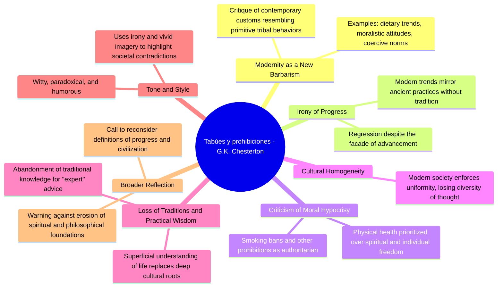

# File Index for 03.1. INTRODUCCION A LOS ESTUDIOS UNIVERSITARIOS
#index

```mermaid
mindmap
  root((Tabúes y prohibiciones - G.K. Chesterton))
    Modernity as a New Barbarism
      Critique of contemporary customs resembling primitive tribal behaviors
      Examples: dietary trends, moralistic attitudes, coercive norms
    Irony of Progress
      Regression despite the facade of advancement
      Modern trends mirror ancient practices without tradition
    Criticism of Moral Hypocrisy
      Smoking bans and other prohibitions as authoritarian
      Physical health prioritized over spiritual and individual freedom
    Cultural Homogeneity
      Modern society enforces uniformity, losing diversity of thought
    Loss of Traditions and Practical Wisdom
      Abandonment of traditional knowledge for "expert" advice
      Superficial understanding of life replaces deep cultural roots
    Tone and Style
      Witty, paradoxical, and humorous
      Uses irony and vivid imagery to highlight societal contradictions
    Broader Reflection
      Call to reconsider definitions of progress and civilization
      Warning against erosion of spiritual and philosophical foundations

```
