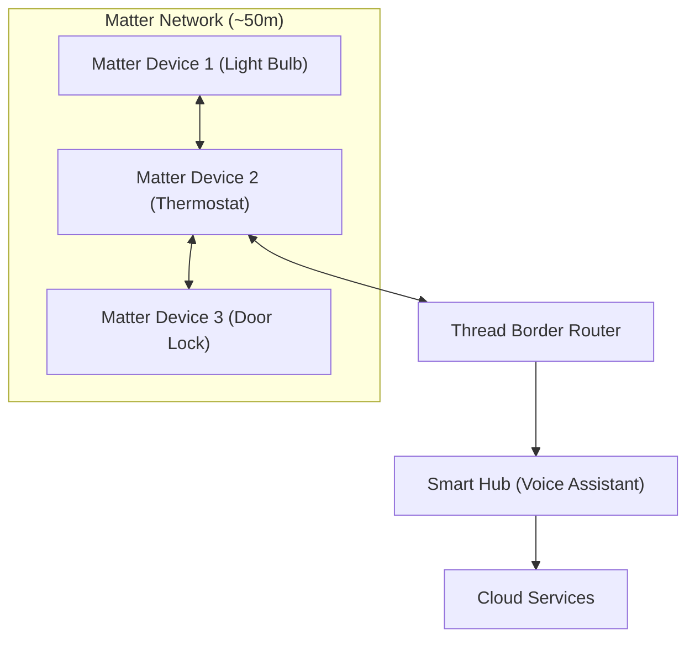
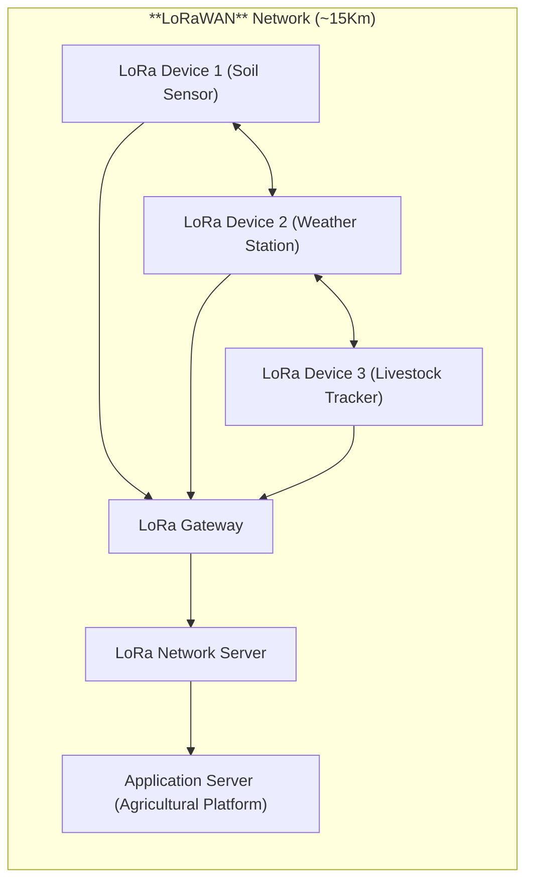

---
Created by: [@raf181_](https://github.com/raf181)  | Date: `01-12-2024`

---

## Comunicaciones en malla en IoT: Habilitando una conectividad fiable y escalable

### **Introducción**  
El Internet de las Cosas (IoT) representa un ecosistema dinámico y en constante expansión donde miles de millones de dispositivos se comunican para automatizar y optimizar diversas tareas. Para que las redes IoT funcionen de manera efectiva, es esencial contar con arquitecturas de comunicación robustas, especialmente en entornos distribuidos. Entre estas arquitecturas, la comunicación en malla ha surgido como una solución confiable y escalable. A diferencia de los sistemas tradicionales de tipo hub-and-spoke, las redes en malla permiten que los dispositivos se interconecten y transmitan datos a través de múltiples rutas, creando una infraestructura auto reparable y adaptable. Este documento explora el papel de las comunicaciones en malla en IoT, con un enfoque en los protocolos **Matter** y **LoRaWAN**, que están liderando la habilitación de ecosistemas IoT robustos.

---

### **Redes en malla en IoT**  
Una red en malla es un sistema descentralizado donde los nodos (dispositivos) se comunican directamente entre sí para compartir datos. Este diseño elimina la dependencia de un único enrutador central y distribuye las responsabilidades de comunicación en toda la red. Si un nodo falla o encuentra una obstrucción, los datos pueden redirigirse a través de rutas alternativas, garantizando la continuidad del servicio. Esta resiliencia hace que las redes en malla sean especialmente valiosas en aplicaciones de IoT, donde los dispositivos pueden estar dispersos en áreas amplias, como campos agrícolas, complejos industriales o redes urbanas inteligentes.

Además de su resiliencia, las redes en malla ofrecen una gran escalabilidad. Agregar nuevos dispositivos no sobrecarga el sistema, sino que mejora su alcance y confiabilidad. La capacidad de extender la cobertura a través de nodos intermedios también hace que la comunicación en malla sea adecuada para entornos con terrenos difíciles o infraestructura limitada. Por estas razones, las redes en malla se han convertido en un pilar fundamental para proyectos de IoT que van desde hogares inteligentes hasta sistemas de monitoreo ambiental.

---

### **Protocolos que impulsan las comunicaciones en malla: Matter y LoRaWAN**  
Varios protocolos permiten las comunicaciones en malla en IoT, cada uno adaptado a necesidades y entornos específicos. Entre estos, **Matter** y **LoRaWAN** han ganado una atención significativa por sus capacidades y aplicaciones únicas.

El protocolo **Matter**, desarrollado por la Connectivity Standards Alliance (CSA), es un estándar innovador que enfatiza la interoperabilidad y la comunicación segura. Está diseñado para unificar el ecosistema del hogar inteligente al permitir que dispositivos de diferentes fabricantes se comuniquen sin problemas. **Matter** integra tecnologías existentes, como Wi-Fi y Thread, para crear una red en malla confiable y fácil de usar. Thread, un componente crítico de **Matter**, opera como un protocolo inalámbrico de bajo consumo que facilita la comunicación directa entre dispositivos en la malla. Esta capacidad es particularmente ventajosa en hogares inteligentes, donde dispositivos como luces, cerraduras y termostatos deben coordinarse de manera eficiente. **Matter** también prioriza la seguridad mediante el cifrado de extremo a extremo, garantizando que los datos de los usuarios permanezcan confidenciales y protegidos contra manipulaciones.

Por otro lado, **LoRaWAN** está orientado a un segmento diferente del IoT, centrándose en la comunicación de largo alcance y bajo consumo. Aunque **LoRaWAN** utiliza tradicionalmente una topología de estrella de estrellas con puertas de enlace centralizadas, su adaptabilidad le permite complementar configuraciones en malla en ciertos escenarios. Este protocolo es ideal para aplicaciones IoT al aire libre e industriales, como la agricultura de precisión, el monitoreo ambiental y la gestión de activos. Su capacidad para cubrir distancias de hasta 15 kilómetros en áreas rurales lo hace invaluable para conectar dispositivos en ubicaciones remotas. Además, su eficiencia energética respalda el despliegue de sensores alimentados por batería que pueden operar durante años sin mantenimiento. Aunque **LoRaWAN** no utiliza inherentemente una estructura de malla completa, las implementaciones híbridas pueden integrar sus capacidades de largo alcance en marcos de malla para una mayor versatilidad.

---

### **Aplicaciones y ventajas de las comunicaciones en malla**  
Los sistemas de comunicación en malla están transformando el IoT en diversas industrias al ofrecer una conectividad sin igual en términos de confiabilidad, cobertura y adaptabilidad. En los hogares inteligentes, los dispositivos habilitados por **Matter** eliminan problemas de compatibilidad, creando entornos cohesivos donde electrodomésticos, sensores y controladores trabajan en armonía. En la agricultura, **LoRaWAN** facilita el despliegue de sensores que monitorean las condiciones del suelo, los patrones climáticos y los movimientos del ganado en áreas extensas. Las aplicaciones industriales de IoT también se benefician de las redes en malla, ya que proporcionan conectividad consistente en entornos complejos, como fábricas, minas y almacenes. Además, las redes en malla han demostrado ser indispensables en escenarios de recuperación ante desastres, donde sus propiedades auto reparables permiten un rápido despliegue y mantenimiento de canales de comunicación en condiciones desafiantes.

Los beneficios de las comunicaciones en malla van más allá de la conectividad. La tolerancia a fallos inherente garantiza operaciones ininterrumpidas incluso frente a fallos de hardware. La eficiencia energética, particularmente en protocolos como LoRaWAN, prolonga la vida útil de los dispositivos, reduciendo los costos de mantenimiento. Además, la flexibilidad de las redes en malla les permite adaptarse a entornos dinámicos, lo que las convierte en un componente vital en la evolución de la infraestructura IoT. 

---
## Proyectos de Ciberseguridad con IoT
El proyecto **Ghostkey** comenzó como una alternativa económica al USB Rubber Ducky de Hak5. Inicialmente diseñado usando una placa XIAO SAMD21, este dispositivo se ha expandido para incluir módulos adicionales, como el ESP32C6, que permiten inyectar teclas y activar cargas útiles de manera remota. También se desarrollaron servidores de Comando y Control (C2) para gestionar los dispositivos Ghostkey y recopilar datos extraídos de sistemas objetivos, incluyendo servidores de almacenamiento centralizados. Estas capacidades han dado lugar a un conjunto de herramientas modulares y ampliables.

En este proyecto, **LoRaWAN** juega un papel esencial al proporcionar comunicación de largo alcance para dispositivos Ghostkey. Esta tecnología es particularmente útil en aplicaciones donde el Wi-Fi no está disponible o es poco confiable, permitiendo a los nodos Ghostkey enviar y recibir comandos desde grandes distancias. Usando LoRaWAN, es posible extender la funcionalidad de Ghostkey a áreas remotas, ampliando significativamente las posibilidades del proyecto y facilitando el control y monitoreo de dispositivos distribuidos sin depender de infraestructura de red local. Puedes explorar más sobre Ghostkey en sus repositorios oficiales:
- [Ghostkey](https://github.com/Ghostkey-Project/Ghostkey)
- [Ghostkey Server](https://github.com/Ghostkey-Project/Ghostkey_Server)
- [Ghostkey Depo](https://github.com/Ghostkey-Project/Ghostkey_Depo)

```mermaid
---
config:
  theme: neo-dark
  layout: fixed
---
flowchart LR
 subgraph subGraph0["Ghostkey Device"]
    direction LR
        B["LoRaWAN Transmitter"]
        A["SAMD21 & ESP32C6"]
  end
 subgraph subGraph1["Isolated Network"]
    direction RL
        Z["Target Computer"]
        subGraph0
  end
 subgraph subGraph2["Isolated Network"]
    direction RL
        C["Raspberry Pi 5"]
        BB["LoRaWAN Transmitter"]
  end
    A -- USB --o Z
    A <==> B
    B -.- LoRaWAN["LoRaWAN"]
    LoRaWAN -.-> BB
    BB <==> C
    C <== Ethernet ==> E[("C2 Server")]
  
     Z:::Ash
    classDef Ash stroke-width:1px, stroke-dasharray:none, stroke:#999999, fill:#EEEEEE, color:#000000
    style B fill:#C8E6C9,stroke:#333,stroke-width:2px,color:#000000
    style A fill:#f9f,stroke:#333,stroke-width:2px,color:#000000
    style Z stroke:#616161
    style subGraph0 stroke:#000000,fill:#757575
    style C fill:#99f,stroke:#333,stroke-width:2px,color:#000000
    style BB fill:#C8E6C9,color:#000000
    style LoRaWAN stroke-width:4px,stroke-dasharray: 5,stroke:#FF6D00
    style E fill:#7fb,stroke:#333,stroke-width:2px,color:#000000
    style subGraph1 stroke:#FF6D00
    style subGraph2 stroke:#000000,fill:#424242
    linkStyle 2 stroke:#FF6D00,fill:none
    linkStyle 3 stroke:#FF6D00,fill:none
```

---
## **Conclusión**  
La comunicación en malla se ha convertido en un pilar fundamental del IoT al proporcionar una base resiliente y escalable para la conectividad de dispositivos. Protocolos como **Matter** y **LoRaWAN** ejemplifican los diversos enfoques para abordar los desafíos únicos de las aplicaciones IoT. Mientras **Matter** mejora la interoperabilidad y la funcionalidad de las redes de hogares inteligentes, **LoRaWAN** extiende el alcance del IoT a entornos remotos e industriales. Juntos, estos protocolos destacan el potencial transformador de las redes en malla para crear un mundo más conectado y eficiente. A medida que el IoT continúa creciendo, la integración de tecnologías avanzadas de comunicación en malla será crucial para aprovechar al máximo su potencial.

---
